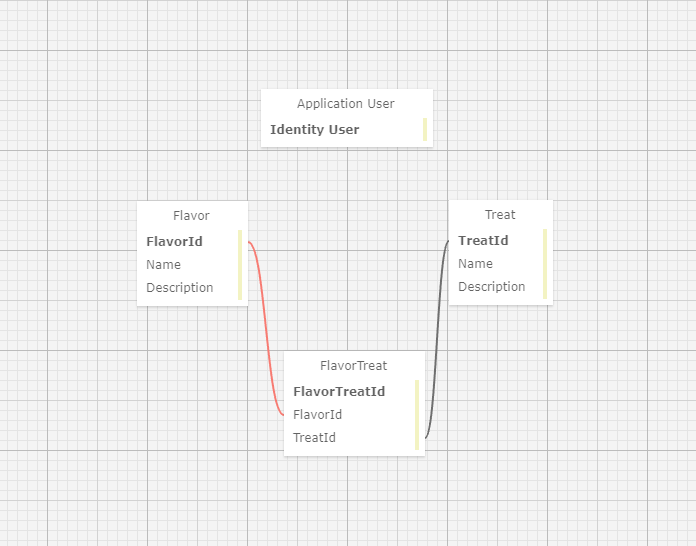

# *The CandyShop*
#### By Trent Dietzel

## Table of Contents
- [About](#about)
- [Features](#features)
- [Technologies Used](#technologies-used)
- [Installation](#installation)
- [Setting Up SQL](#setting-up-the-sql-database)
- [Contributing](#contributing)
- [Known Bugs](#known-bugs)
- [License](#license)
- [Contact](#contact)

## About
The application serves as a inventory management system for a candy shop, offering essential features for logged in users. Users can securely register, log in, and log out of their accounts. Additionally, if logged in they have the ability to perform various actions such as adding, editing, and deleting flavors and treats to personalize their candy shop experience.

## Features
- **User Authentication**: Users can register, log in, and log out securely.
- **Flavor Management**: Users can add, edit, delete, and view details of flavors available in the candy shop.
- **Treat Management**: Users can add, edit, delete, and view details of treats available in the candy shop. 
- **Association**: Users can associate treats with flavors and flavors with treats.

## Technologies Used
- **Language**: C#
- **Framework**: .NET
- **IDE**: Visual Studio
- **Package Manager**: NuGet
- **Version Control**: Git
- **Database**: MySQL
- **ORM**: Entity Framework Core 6.0
- **Build Tool**: MSBuild
- **Web Server**: ASP.NET Core

## Installation
Follow these steps to set up the project locally:
1. Open Git BASH [Download Link](https://gitforwindows.org/)
2. Clone the repository to your local machine:
   ```bash
   git clone https://github.com/tdietzel/CandyShop
   ```
3. Open the project directory:
   ```bash
   cd CandyShop
   ```
4. Open in a code editor like __Visual Studio Code__.
5. In the command line, run the command ``` dotnet run ``` to compile and execute the application.
6. Optionally, you can run ``` dotnet build ``` to compile this console app without running it.

## Setting up the SQL Database
This project uses a SQL database to store and manage data. Follow the instructions below to set up the database environment:

### Prerequisites
- Install SQL Workbench if you haven't already. You can download it from the [official website](https://www.mysql.com/products/workbench/).

### Steps to Set Up the Database
1. **Connect to MySQL Server**
   - Open SQL Workbench.
   - Click on the "+" icon in the "MySQL Connections" tab to create a new connection.
   - Enter the connection details such as hostname, port, username, and password to connect to your MySQL Server instance.

2. **Create a New Database**
   - Once connected, click on the "SQL Editor" tab.
   - Execute the following SQL command to create a new database:
     ```sql
     CREATE DATABASE YourDatabaseName;
     ```

3. **Configure Connection String**
   - In the root of the CandyShop directory, create the `appsettings.json` file.
   - Update the connection string with the appropriate details and add it to that file:
     ```json
        {
          "ConnectionStrings": {
            "DefaultConnection": "Server=YourServerName;database=YourDatabaseName;uid=YourUsername;pwd=YourPassword;"
          }
        }
     ```
     Replace `YourServerName`, `YourDatabaseName`, `YourUsername`, and `YourPassword` with your actual MySQL Server instance details.

4. **Testing Connection**
   - Run the command ``` dotnet ef database update ``` to update your database with the current migrations.
   - Build and run the project using ``` dotnet run ```.
   - Ensure that your application can connect to the database without any errors.

### Database Schema Visualization


## Contributing
I welcome contributions to improve the project. If you'd like to contribute, please follow these guidelines:
1. Fork the project repository.
2. Create a new branch for your feature or bug fix.
3. Make your changes and test thoroughly.
4. Commit your changes with a descriptive commit message.
5. Push your branch to your forked repository.
6. Create a pull request to the main repository.

## Known Bugs
* _N/A_

## License
This project is licensed under the MIT License. See the LICENSE file for details.

## Contact
For any questions, suggestions, or inquiries, please contact **Trent Dietzel** at _dietzelbiz@outlook.com_.
This project is licensed under the MIT License. See the LICENSE file for details.